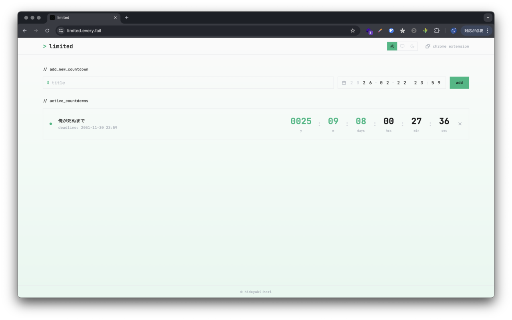
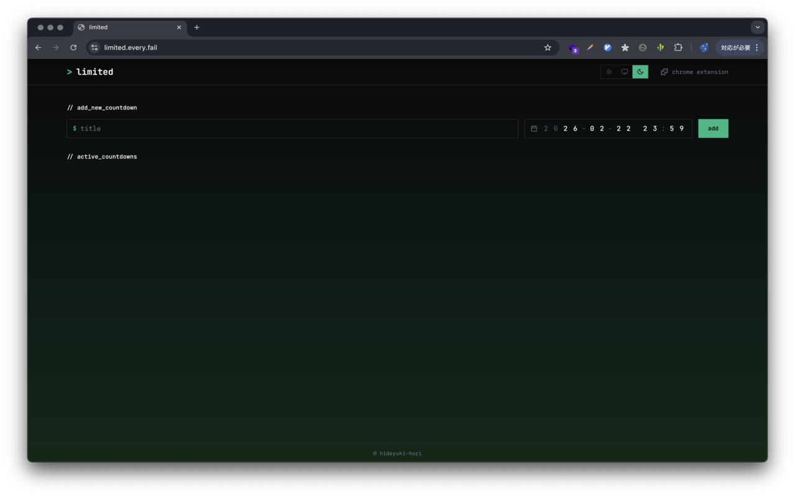

# Limited

A countdown timer app that displays remaining time (down to the second) in real time.




## Features

- Create countdowns with a title and deadline
- Real-time display of remaining time down to the second
- Save up to 10 countdowns
- Available as both a web app and Chrome extension

## Tech Stack

- [SolidJS](https://www.solidjs.com/)
- [Vite](https://vite.dev/)
- [Tailwind CSS](https://tailwindcss.com/)
- [pnpm workspace](https://pnpm.io/workspaces)
- TypeScript

## Project Structure

```
apps/
  web/          # Web app (https://limited.every.fail)
  extension/    # Chrome extension (new tab override)
packages/
  ui/           # Shared UI components
  config/       # Shared configuration
```

## Setup

```bash
pnpm install
```

## Development

```bash
pnpm dev
```

## Build

```bash
# Build all
pnpm build

# Web app only
pnpm build:web

# Chrome extension only
pnpm build:ext
```

## License

[MIT](LICENSE)
